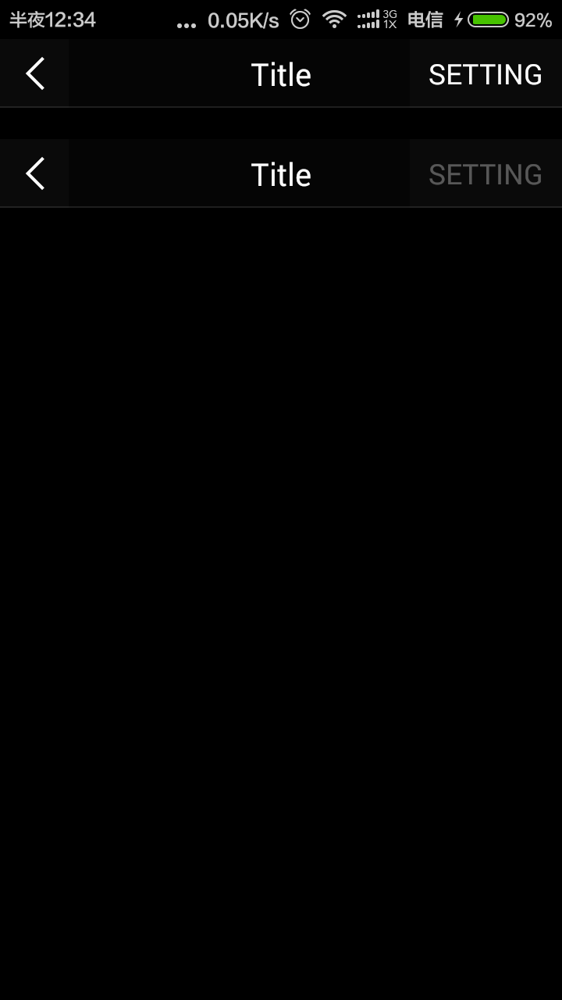

# HandyWidgets
Handy Android widgets.

##CenterTitleSideButtonBar
[  ](https://bintray.com/piasy/maven/HandyWidgets/_latestVersion)

+  Download  
```groovy
    repositories {
        maven {
            url  "http://dl.bintray.com/piasy/maven"
        }
    }
    
    dependencies {
        compile 'com.github.piasy:centertitlesidebuttonbar:${latest version}'
    }
```
+  Usage  
In xml layout file:
```xml
    <com.github.piasy.handywidgets.centertitlesidebuttonbar.CenterTitleSideButtonBar
        xmlns:ctsbb="http://schemas.android.com/apk/res-auto"
        android:id="@+id/mTitleBar"
        android:layout_width="match_parent"
        android:layout_height="44dp"
        android:layout_marginTop="20dp"
        android:background="#05FFFFFF"
        ctsbb:hasLeftButton="true"
        ctsbb:leftButtonSrc="@drawable/iv_back"
        ctsbb:leftButtonBg="@drawable/btn_back_bg_selector"
        ctsbb:hasRightButton="true"
        ctsbb:rightButtonAsText="true"
        ctsbb:rightButtonText="SETTING"
        ctsbb:rightButtonTextColor="@drawable/white_text_selector"
        ctsbb:rightButtonTextSize="9sp"
        ctsbb:rightButtonBg="@drawable/btn_back_bg_selector"
        ctsbb:hasTitle="true"
        ctsbb:centerTitleTextColor="@android:color/white"
        ctsbb:centerTitle="Title"
        ctsbb:centerTitleTextGravity="center"
        ctsbb:centerTitleTextSize="10sp"
        ctsbb:hasDivider="true"
        ctsbb:dividerHeight="1dp"
        ctsbb:dividerColor="#19FFFFFF"
        />
```
In Java code:
```java
    CenterTitleSideButtonBar titleBar = (CenterTitleSideButtonBar) findViewById(R.id.mTitleBar);
    titleBar.showRightButton();
    titleBar.setLeftButtonOnClickListener(new View.OnClickListener() {
        @Override
        public void onClick(View v) {
            Toast.makeText(MainActivity.this, "Left Button Clicked 1", Toast.LENGTH_SHORT)
                    .show();
        }
    });
    titleBar.setRightButtonOnClickListener(new View.OnClickListener() {
        @Override
        public void onClick(View v) {
            Toast.makeText(MainActivity.this, "Right Button Clicked 1", Toast.LENGTH_SHORT)
                    .show();
        }
    });
```
+  Screenshot  
