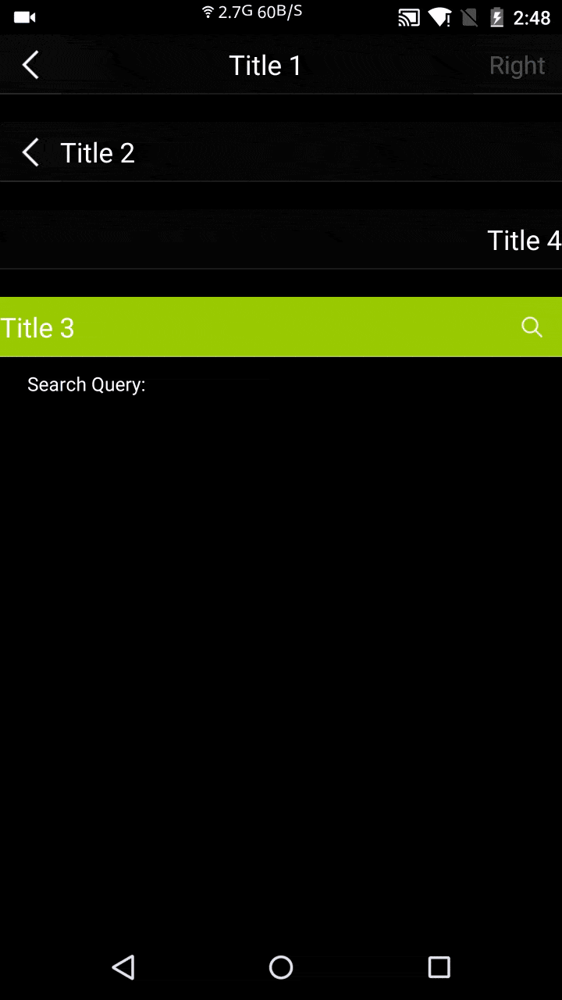

#CenterTitleSideButtonBar
[  ](https://bintray.com/piasy/maven/HandyWidgets/_latestVersion) [](https://android-arsenal.com/details/1/2455)  
Title bar with center title TextView, side(left & right) button and bottom divider.  
Allow fully customization against the title bar. No more Google/StackOverFlow search for customize ActionBar/Toolbar again!

+  Screenshot  

+  Download
```groovy
    repositories {
        jcenter()
    }

    dependencies {
        compile 'com.github.piasy:centertitlesidebuttonbar:${latest version}'
    }
```
+  Usage
  +  In xml layout file:
    ```xml
        <com.github.piasy.handywidgets.centertitlesidebuttonbar.CenterTitleSideButtonBar
            xmlns:ctsbb="http://schemas.android.com/apk/res-auto"
            android:id="@+id/mTitleBarFull"
            android:layout_width="match_parent"
            android:layout_height="44dp"
            android:background="#05FFFFFF"
            ctsbb:hasLeftButton="true"
            ctsbb:leftButtonId="@+id/mTitleBarLeftButton"
            ctsbb:leftButtonShownDefault="true"
            ctsbb:leftButtonSrc="@drawable/iv_back"
            ctsbb:leftButtonBg="@drawable/btn_back_bg_selector"
            ctsbb:hasRightButton="true"
            ctsbb:rightButtonId="@+id/mTitleBarRightButton"
            ctsbb:rightButtonShownDefault="true"
            ctsbb:rightButtonAsText="true"
            ctsbb:rightButtonText="Right"
            ctsbb:rightButtonTextColor="@drawable/white_text_selector"
            ctsbb:rightButtonTextSize="9sp"
            ctsbb:rightButtonBg="@drawable/btn_back_bg_selector"
            ctsbb:hasTitle="true"
            ctsbb:titleId="@+id/mTitleBarTitle"
            ctsbb:centerTitleTextColor="@android:color/white"
            ctsbb:centerTitle="Title 1"
            ctsbb:centerTitleTextGravity="center"
            ctsbb:centerTitleTextSize="10sp"
            ctsbb:centerTitleEllipsize="end"
            ctsbb:hasDivider="true"
            ctsbb:dividerId="@+id/mTitleBarDivider"
            ctsbb:dividerHeight="1dp"
            ctsbb:dividerColor="#19FFFFFF"
            />
    ```
  +  Using style to reduce boilerplate code:
    ```xml
        <com.github.piasy.handywidgets.centertitlesidebuttonbar.CenterTitleSideButtonBar
            xmlns:ctsbb="http://schemas.android.com/apk/res-auto"
            android:id="@+id/mTitleBar"
            ctsbb:centerTitle="Title"
            style="@style/TitleBarWithDividerLeftButton"
            />
            
        <style name="TitleBarWithDividerLeftButton">
            <item name="android:layout_width">match_parent</item>
            <item name="android:layout_height">44dp</item>
            <item name="android:background">@color/white_transparent_2</item>
            <item name="hasLeftButton">true</item>
            <item name="leftButtonSrc">@mipmap/iv_back</item>
            <item name="leftButtonBg">@drawable/btn_back_bg_selector</item>
            <item name="hasTitle">true</item>
            <item name="centerTitleTextColor">@color/white</item>
            <item name="centerTitleTextGravity">center</item>
            <item name="centerTitleTextSize">@dimen/text_44pt</item>
            <item name="hasDivider">true</item>
            <item name="dividerHeight">1dp</item>
            <item name="dividerColor">@color/white_transparent_10</item>
        </style>
    ```
  +  In Java code:
    ```java
        CenterTitleSideButtonBar mTitleBarFull = (CenterTitleSideButtonBar) findViewById(R.id.mTitleBarFull);
        mTitleBarFull.showRightButton();
        mTitleBarFull.setLeftButtonOnClickListener(new View.OnClickListener() {
            @Override
            public void onClick(View v) {
                Toast.makeText(MainActivity.this, "Left Button Clicked 1", Toast.LENGTH_SHORT)
                        .show();
            }
        });
        mTitleBarFull.setRightButtonOnClickListener(new View.OnClickListener() {
            @Override
            public void onClick(View v) {
                Toast.makeText(MainActivity.this, "Right Button Clicked 1", Toast.LENGTH_SHORT)
                        .show();
            }
        });
    ```
  +  Search bar support  
  declare in layout
  ```xml
    <com.github.piasy.handywidgets.centertitlesidebuttonbar.CenterTitleSideButtonBar
        xmlns:android="http://schemas.android.com/apk/res/android"
        xmlns:app="http://schemas.android.com/apk/res-auto"
        android:id="@+id/mTitleBarSearch"
        android:layout_width="match_parent"
        android:layout_height="44dp"
        android:layout_marginTop="20dp"
        android:background="@android:color/holo_green_light"
        app:hasRightButton="true"
        app:rightButtonId="@+id/mTitleBar3RightButton"
        app:rightButtonShownDefault="true"
        app:rightButtonSrc="@drawable/iv_search"
        app:rightButtonBg="@drawable/btn_back_bg_selector"
        app:hasTitle="true"
        app:centerTitleTextColor="@android:color/white"
        app:centerTitle="Title 3"
        app:centerTitleTextGravity="left"
        app:centerTitleTextSize="20sp"
        app:hasDivider="true"
        app:dividerHeight="1dp"
        app:dividerColor="#19FFFFFF"
    
        app:rightButtonAsSearchView="true"
        app:rightButtonClickToSearch="true"
        app:searchViewBg="@drawable/round_corner_bg2"
        app:searchViewHeight="28dp"
        app:searchViewMarginLeft="8dp"
        app:hasIcon="true"
        app:iconRes="@drawable/iv_search_grey"
        app:iconMarginLeft="10dp"
        app:iconMarginRight="3dp"
        app:editTextSize="14sp"
        app:clearableEditTextColor="#000000"
        app:clearableEditTextHintColor="#777777"
        app:editTextHintContent="@string/text_search"
        app:clearIconRes="@drawable/clear_edit_selector"
        app:clearIconMarginLeft="10dp"
        app:clearIconMarginRight="0dp"
        app:editTextAutoFocus="true"
        app:closeSearchViewId="@+id/mCloseSearchViewButton"
        app:closeSearchViewText="@string/text_cancel"
        app:closeSearchViewTextColor="@drawable/white_text_selector"
        app:closeSearchViewTextSize="18sp"
        />
  ```  
  use in code
  ```java
    mTitleBarSearch.searchQueryChanges()
            .compose(this.<CharSequence>bindToLifecycle())
            .subscribe(new Action1<CharSequence>() {
                @Override
                public void call(CharSequence query) {
                    mTvSearchQuery.setText("Search Query: " + query);
                }
            });
    mTitleBarSearch.setOnEditorActionDoneListener(new OnEditorActionDoneListener() {
        @Override
        public void onEditorActionDone() {
            mTvEditorAction.setText("ACTION_DONE detected!");
        }
    });
  ```
  +  Full example could be found at [the app module](../app/)

+  Customization
  +  hasTitle/hasLeftButton/hasRightButton/hasDivider
  +  leftButtonShownDefault/rightButtonShownDefault (show the button by defualt, or you can show/hide/enable/disable the button through `CenterTitleSideButtonBar`'s API)
  +  leftButtonAsText/rightButtonAsText
  +  leftButtonText/leftButtonTextSize/leftButtonTextColor (so does right button)
  +  leftButtonSrc (only for image button)
  +  leftButtonBg (both for Button & ImageButton, customize the state background for button)
  +  centerTitle (set title text)
  +  centerTitleTextSize/centerTitleTextColor/centerTitleTextGravity (gravity values are: left, right, center)
  +  dividerHeight/dividerColor
  +  leftButtonId/rightButtonId/titleId/dividerId (to align title to left/right, the button id must be set if the side button exist, and with the view ids, you can retrieve these views and do more customization as you can imagine)
  +  and more...
+  Todo
  +  shadow/elevation
  +  ~~search bar~~
  +  trainsition customization support
  +  multi buttons at one side
+  Acknowledgement  
Thanks for the improvement of [promeG](https://github.com/promeG/).
