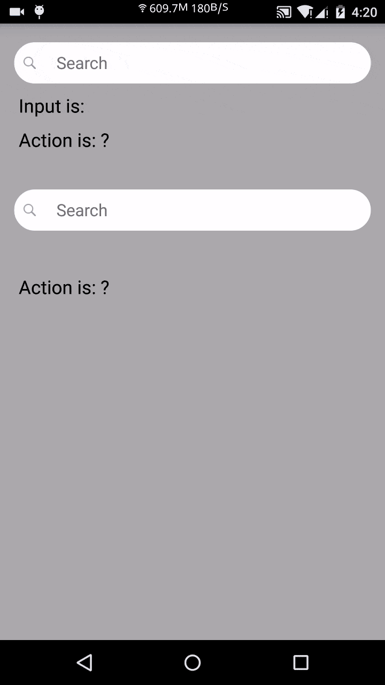

#ClearableEditText
[  ](https://bintray.com/piasy/maven/HandyWidgets/_latestVersion) [](https://android-arsenal.com/details/1/2455)  
A widget which has functions of EditText, has a clear button, and has an optional search icon, also with ability for full customization. This widget also provide method to get notified when text content changed, or editor action happens, in both traditional listener and popular Rx Observable way!

+  Screenshot  

+  Download
```groovy
    repositories {
        jcenter()
    }

    dependencies {
        compile 'com.github.piasy:clearableedittext:${latest version}'
    }
```
+  Usage
  +  In xml layout file:
```xml
    <com.github.piasy.handywidgets.clearableedittext.ClearableEditText
        xmlns:android="http://schemas.android.com/apk/res/android"
        xmlns:app="http://schemas.android.com/apk/res-auto"
        android:id="@+id/mClearableEditText"
        android:layout_width="match_parent"
        android:layout_height="44dp"
        android:layout_marginTop="40dp"
        android:layout_marginLeft="15dp"
        android:layout_marginRight="15dp"
        android:background="@drawable/round_corner_bg"
        app:hasSearchIcon="true"
        app:searchIconRes="@drawable/iv_search_grey"
        app:searchIconMarginLeft="10dp"
        app:searchIconMarginRight="10dp"
        app:editTextSize="18sp"
        app:clearableEditTextHintColor="#777777"
        app:editTextHintContent="Search"
        app:clearIconRes="@drawable/clear_edit_selector"
        app:clearIconMarginLeft="10dp"
        app:clearIconMarginRight="10dp"
        />
```
  +  Get notified in popular Rx Observable way:
```java
      mClearableEditText.textChanges().subscribe(new Action1<CharSequence>() {
          @Override
          public void call(CharSequence charSequence) {
              mTvInput.setText("Input is: " + charSequence);
          }
      });
      mClearableEditText.setImeOptions(EditorInfo.IME_ACTION_DONE);
      mClearableEditText.editorActions().subscribe(new Action1<Integer>() {
          @Override
          public void call(Integer code) {
              Log.d("ClearableEditText", "ClearableEditText Action: " + code);
              if (code == EditorInfo.IME_ACTION_DONE) {
                  mTvAction.setText("IME_ACTION_DONE detected");
              }
          }
      });
```
  +  Get notified in traditional listener way:
```java
      mClearableEditText2.setOnTextChangedListener(new OnTextChangedListener() {
          @Override
          public void onTextChanged(CharSequence text) {
              mTvInput2.setText("Input is: " + text);
          }
      });
      mClearableEditText2.setOnEditorActionDoneListener(new OnEditorActionDoneListener() {
          @Override
          public void onEditorActionDone() {
              mTvAction2.setText("IME_ACTION_DONE detected");
          }
      });
```
  +  Full example could be found at [the app module](../app/)

+  Acknowledgement
Thanks for the awesome [RxBinding library](https://github.com/JakeWharton/RxBinding/).
