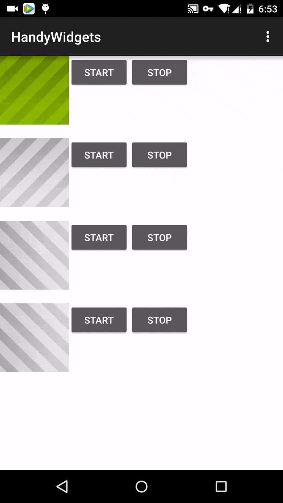

#EndlessMovingView
[  ](https://bintray.com/piasy/maven/HandyWidgets/_latestVersion)  
A handy view that support endless moving a drawable(image, xml drawable), or a custom figure recorded in a [Path](http://developer.android.com/reference/android/graphics/Path.html).  
An endless moving view is a period graph, it repeat its single period to fill the view, and shifting towards the direction with the speed configured.

+  Screenshot  

+  Download
```groovy
    repositories {
        jcenter()
    }

    dependencies {
        compile 'com.github.piasy:endlessmovingview:${latest version}'
    }
```
+  Usage
  +  customization
    +  movingDir: left/right/up/down
    +  movingSpeed: pixels per frame, in 60 fps
    +  paintColor/paintStyle(fill, stroke, fill_and_stroke): used for EndlessMovingPathView to config the Paint used to draw the path
    +  singlePeriodBitmap: used for EndlessMovingBitmapView, set the single period graph
    +  stopWhenLoseFocus: whether stop moving when window lose focus
    +  autoStart:  whether start moving after inflated
  +  EndlessMovingBitmapView  
  Just set the moving direction & speed, and set one single period graph for the total graph in xml is enough  
  ```xml
    <com.github.piasy.handywidgets.endlessmovingview.EndlessMovingBitmapView
        xmlns:app="http://schemas.android.com/apk/res-auto"
        android:id="@+id/mEndlessMovingViewLeft"
        android:background="@android:color/holo_green_light"
        android:layout_width="100dp"
        android:layout_height="100dp"
        app:movingDir="left"
        app:movingSpeed="2"
        app:paintColor="@android:color/holo_blue_bright"
        app:paintStyle="fill"
        app:singlePeriodBitmap="@drawable/iv_loading"
        app:stopWhenLoseFocus="false"
        app:autoStart="true"
        />
  ```
  +  EndlessMovingPathView  
  Excend `EndlessMovingPathView` and override its `getSinglePeriodGraphWidth()`, `getSinglePeriodGraphHeight()`, `drawPath(Path path, @EndlessMovingView.MovingDir int movingDir, int start, int minX, int maxX, int minY, int maxY)` method, to set single period graph width, height, and draw one single graph in the `Path` object.  
  Examples is [xml](../app/src/main/res/layout/activity_endless_moving_view.xml#L147), [code](../app/src/main/java/com/github/piasy/handywidgets/SimpleEndlessMovingPathView.java).
  
+  Todo
  +  Correct start/stop control
  +  ~~EndlessMovingPathView~~
  +  Screenshot
  +  Performance opt
  
+  Acknowledgement
  +  Inspired by naman14's [WashingMachineView](https://github.com/naman14/WashingMachineView)
  +  Gififying with [gifify](https://github.com/maxogden/gifify)
